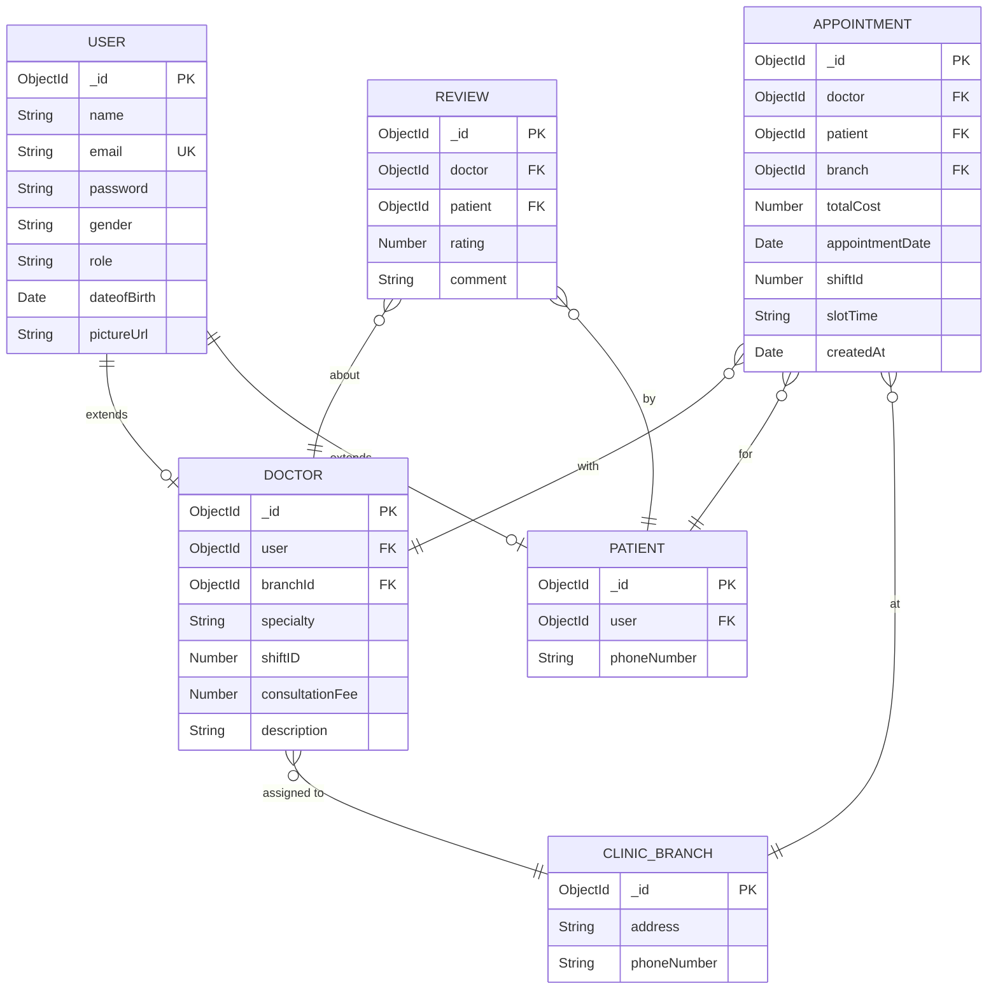

# Project Overview Document

## Mr. Dentist — Clinic Management System

| Attribute        | Detail                                     |
| ---------------- | ------------------------------------------ |
| **Project Name** | Mr. Dentist                                |
| **Version**      | 1.0.0                                      |
| **Status**       | Active Development                         |
| **Stack**        | React · Node.js / Express · MongoDB        |
| **Last Updated** | 2026-05-19                                 |

---

## 1. Introduction

**Mr. Dentist** is an enterprise-grade, full-stack Clinic Management System purpose-built for dental clinics that operate across multiple physical branches. The platform digitises the end-to-end patient journey — from self-service registration and doctor discovery through appointment booking, post-visit reviews, and administrative branch management — while enforcing strict role-based access control (RBAC) at every layer.

The system is architected as a decoupled client-server application:

- **Frontend (Presentation Layer):** A React single-page application built with Vite, employing React Router for client-side routing, Formik & Yup for form validation, Axios for HTTP communication, and Bootstrap 5 for responsive UI components.
- **Backend (Service & Data Access Layers):** A Node.js REST API powered by Express 5, secured with JWT authentication, rate-limited via `express-rate-limit`, and connected to a MongoDB Atlas replica set through Mongoose 9.
- **Cloud Services:** Cloudinary for profile picture uploads and storage; MongoDB Atlas for managed database hosting.

---

## 2. Core Objectives

| #   | Objective                                  | Description                                                                                                                                                     |
| --- | ------------------------------------------ | --------------------------------------------------------------------------------------------------------------------------------------------------------------- |
| O-1 | **Multi-Branch Operations**                | Enable a single dental clinic organisation to manage multiple geographic branches, each with its own address and contact information.                            |
| O-2 | **Role-Based Access Control**              | Enforce three distinct user roles — *Patient*, *Doctor*, and *Admin* — each with precisely scoped permissions across every API endpoint.                         |
| O-3 | **Streamlined Appointment Booking**        | Provide patients with a real-time, shift-aware slot-availability engine that prevents double-booking through compound unique indexing at the database level.     |
| O-4 | **Patient Self-Service**                   | Allow patients to register, authenticate, manage their profile (including profile picture uploads), book appointments, and submit reviews autonomously.          |
| O-5 | **Doctor Management**                      | Give administrators full CRUD control over doctor records (including transactional User + Doctor creation) and allow doctors to view their own appointments and reviews. |
| O-6 | **Feedback & Quality Assurance**           | Implement a patient review system (1–5 rating with optional comments) with built-in duplicate-review prevention to maintain data integrity.                     |
| O-7 | **Security & Resilience**                  | Protect all sensitive operations with JWT-based authentication, bcrypt password hashing, global rate limiting, and centralized error handling.                   |

---

## 3. Project Scope

### 3.1 In Scope

- User authentication (registration, login, profile management, password update, profile picture upload)
- Full CRUD for **Clinic Branches** (admin-only)
- Full CRUD for **Doctors** (admin creates/deletes; doctor/admin updates)
- Full CRUD for **Patients** (admin creates/updates/deletes; patients self-register)
- **Appointment Booking** with shift-aware time-slot generation, availability checking, and double-booking prevention
- **Review System** with per-doctor, per-patient uniqueness enforcement
- Global error handling middleware
- API rate limiting (100 requests per 15-minute window per IP)
- Cloudinary-based image upload for user profile pictures
- React-based responsive frontend with routing, context-based auth state, and form validation

### 3.2 Out of Scope (Future Considerations)

- Payment processing and invoicing
- SMS / email notification system
- Real-time chat between patients and doctors
- Reporting and analytics dashboards
- Multi-language (i18n) support
- Mobile applications (iOS / Android)

---

## 4. System Entities

The system is built around six core domain entities, each mapped to a Mongoose model and backed by a dedicated Repository.

### 4.1 User

| Aspect          | Detail                                                                                      |
| --------------- | ------------------------------------------------------------------------------------------- |
| **Purpose**     | Centralised identity record shared by Patients, Doctors, and Admins via a role discriminator.|
| **Collection**  | `users`                                                                                     |
| **Key Fields**  | `name`, `email` (unique), `password` (bcrypt-hashed), `gender`, `role`, `dateofBirth`, `pictureUrl` |
| **Roles**       | `patient`, `doctor`, `admin`                                                                |
| **Relationships** | Referenced by `Doctor.user` and `Patient.user` (1-to-1)                                   |

### 4.2 Doctor

| Aspect          | Detail                                                                                     |
| --------------- | ------------------------------------------------------------------------------------------ |
| **Purpose**     | Extends a User with dental-practice-specific attributes; assigned to a single branch.      |
| **Collection**  | `doctors`                                                                                  |
| **Key Fields**  | `user` (ref → User), `branchId` (ref → ClinicBranch), `specialty`, `shiftID`, `consultationFee`, `description` |
| **Shifts**      | `0` = Morning (08:00–16:00), `1` = Afternoon (16:00–00:00), `2` = Night (00:00–08:00)     |
| **Relationships** | Belongs to one ClinicBranch; has many Appointments and Reviews                            |
| **Lifecycle**   | Created/deleted transactionally with its associated User record (MongoDB sessions)         |

### 4.3 Patient

| Aspect          | Detail                                                                                     |
| --------------- | ------------------------------------------------------------------------------------------ |
| **Purpose**     | Extends a User with patient-specific contact information.                                  |
| **Collection**  | `patients`                                                                                 |
| **Key Fields**  | `user` (ref → User), `phoneNumber`                                                        |
| **Relationships** | Has many Appointments and Reviews                                                        |
| **Lifecycle**   | Created transactionally with its associated User record; self-registered via `/api/auth/register` |

### 4.4 ClinicBranch

| Aspect          | Detail                                                                                     |
| --------------- | ------------------------------------------------------------------------------------------ |
| **Purpose**     | Represents a physical clinic location with an address and contact number.                  |
| **Collection**  | `clinicbranches`                                                                           |
| **Key Fields**  | `address`, `phoneNumber`                                                                   |
| **Relationships** | Referenced by `Doctor.branchId` and `Appointment.branch`                                 |
| **Access**      | Full CRUD restricted to admin role                                                         |

### 4.5 Appointment

| Aspect          | Detail                                                                                     |
| --------------- | ------------------------------------------------------------------------------------------ |
| **Purpose**     | Records a booked time slot between a patient and a doctor at a specific branch.            |
| **Collection**  | `appointments`                                                                             |
| **Key Fields**  | `doctor` (ref), `patient` (ref), `branch` (ref), `totalCost`, `appointmentDate`, `shiftId`, `slotTime`, `createdAt` |
| **Constraints** | Compound unique index on `{doctor, appointmentDate, shiftId, slotTime}` prevents double-booking |
| **Slot Format** | `HH:MM` (24-hour), validated via regex `^([01]\d|2[0-3]):[0-5]\d$`                        |
| **Relationships** | Belongs to one Doctor, one Patient, and one ClinicBranch                                 |

### 4.6 Review

| Aspect          | Detail                                                                                     |
| --------------- | ------------------------------------------------------------------------------------------ |
| **Purpose**     | Captures patient feedback on a doctor's service.                                           |
| **Collection**  | `reviews`                                                                                  |
| **Key Fields**  | `doctor` (ref), `patient` (ref), `rating` (1–5), `comment` (optional)                     |
| **Constraints** | Application-level enforcement: one review per patient per doctor                            |
| **Relationships** | Belongs to one Doctor and one Patient                                                    |

---

## 5. Entity Relationship Diagram



---

## 6. Architectural Layers

The backend follows a strict **three-tier layered architecture**:

```
┌───────────────────────────────────────────────────┐
│                Presentation Layer                  │
│   React SPA (Vite · React Router · Formik · Axios)│
├───────────────────────────────────────────────────┤
│                  Service Layer                     │
│   Express Routes → Middleware → Controllers        │
│   (AuthMiddleware · ErrorHandler · RateLimit)      │
├───────────────────────────────────────────────────┤
│               Data Access Layer                    │
│   Repositories → Mongoose Models → MongoDB Atlas   │
│   (Helpers: SlotsHelper · AuthHelper · Cloudinary) │
└───────────────────────────────────────────────────┘
```

| Layer                   | Responsibility                                                                 |
| ----------------------- | ------------------------------------------------------------------------------ |
| **Presentation Layer**  | User interface, client-side routing, form validation, API consumption           |
| **Service Layer**       | Request handling, business logic, authentication/authorization, error handling  |
| **Data Access Layer**   | Database communication, schema definitions, data integrity, helper utilities   |

---

*Document prepared for Mr. Dentist Clinic Management System — Confidential.*
