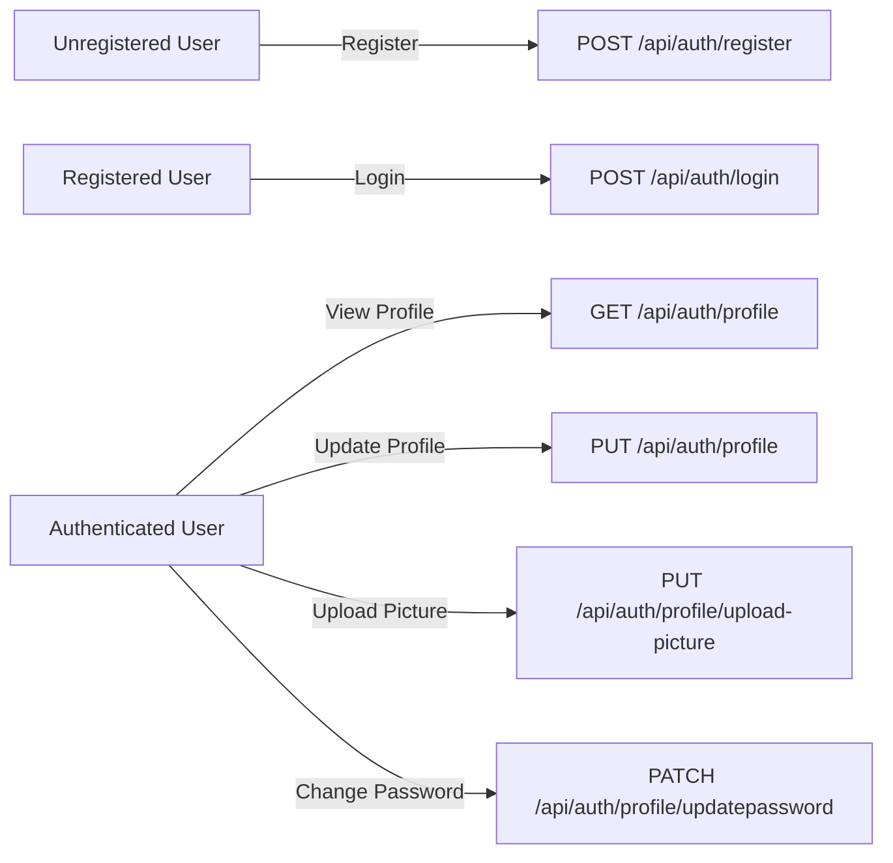
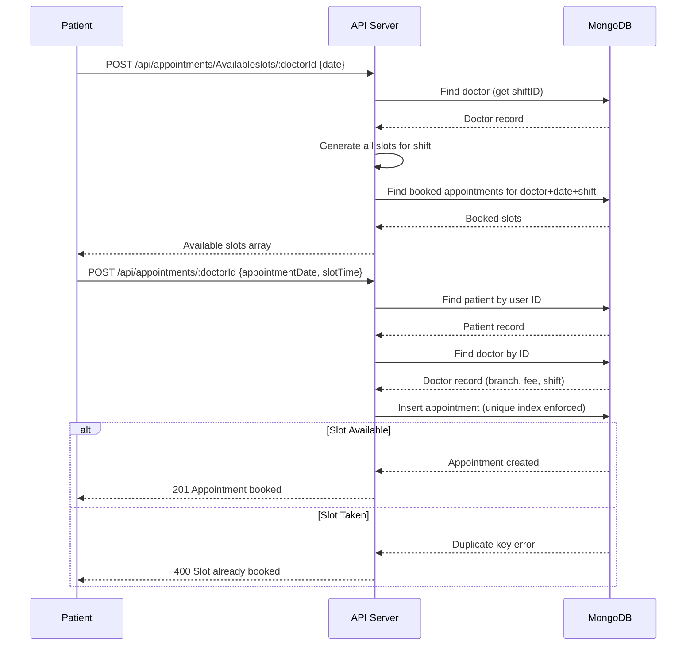

# Functional Requirements Document (FRD)

## Mr. Dentist — Clinic Management System

| Attribute          | Detail                                      |
| ------------------ | ------------------------------------------- |
| **Document Type**  | Functional Requirements Document (FRD)      |
| **Version**        | 1.0.0                                       |
| **Last Updated**   | 2026-05-19                                  |
| **Audience**       | Product Owners · QA Engineers · Developers  |

---

## 1. Purpose

This document describes the functional requirements of the Mr. Dentist Clinic Management System from an **end-user perspective**. It focuses on two primary functions that form the core user experience: **User Authentication & Profile Management** and **Appointment Booking & Management**.

---

## 2. User Roles

The system supports three distinct user roles, each with different access permissions:

| Role        | Description                                                                                                  |
| ----------- | ------------------------------------------------------------------------------------------------------------ |
| **Patient** | End users who register, book appointments with doctors, and submit reviews.                                  |
| **Doctor**  | Medical professionals who view their scheduled appointments and patient reviews.                             |
| **Admin**   | System administrators who manage doctors, patients, clinic branches, and system-wide appointment operations. |

---

## 3. Primary Function 1 — User Authentication & Profile Management

### 3.1 Overview

This function encompasses the complete user lifecycle: registration, authentication, session management, profile viewing and editing, profile picture upload, and password management. It serves as the gateway to all other system features and underpins the RBAC model.

### 3.2 Functional Requirements

#### FR-1.1 Patient Registration

| Field              | Detail                                                                                 |
| ------------------ | -------------------------------------------------------------------------------------- |
| **Description**    | A new user can create a patient account by submitting a registration form.             |
| **Actors**         | Unregistered User                                                                      |
| **Preconditions**  | The user does not have an existing account with the provided email address.            |
| **Trigger**        | User submits the registration form on the `/register` page.                            |
| **Input**          | `name`, `email`, `password`, `gender` (male/female), `dateofBirth`, `phoneNumber`, optional `pictureUrl` |
| **Processing**     | 1. Validate that the email is not already in use. 2. Hash the password using bcrypt with 10 salt rounds. 3. Create a User record with role = `patient`. 4. Create a linked Patient record with the user's phone number. |
| **Output**         | HTTP 201 with `{ message: "User registered successfully", data: <user> }`             |
| **Postconditions** | A User and Patient record pair exist in the database; the user can now log in.         |
| **Error Scenarios**| • Email already in use → 400 `"Email already in use"`   • Server error → 500       |

#### FR-1.2 User Login

| Field              | Detail                                                                                 |
| ------------------ | -------------------------------------------------------------------------------------- |
| **Description**    | A registered user authenticates by providing their email and password.                 |
| **Actors**         | Registered User (any role)                                                              |
| **Preconditions**  | The user has a valid account.                                                          |
| **Trigger**        | User submits the login form on the `/login` page.                                      |
| **Input**          | `email`, `password`                                                                    |
| **Processing**     | 1. Look up user by email (case-insensitive). 2. Compare provided password against stored bcrypt hash. 3. Generate a JWT containing `{ id, role }` with a configurable expiration (default: 7 days). |
| **Output**         | HTTP 200 with `{ message: "Login successful", token: "<JWT>", data: <user> }`          |
| **Postconditions** | Client stores the JWT and includes it in the `Authorization: Bearer <token>` header for subsequent requests. |
| **Error Scenarios**| • Invalid email or password → 400 `"Invalid email or password"`   • Server error → 500 |

#### FR-1.3 View Profile

| Field              | Detail                                                                                 |
| ------------------ | -------------------------------------------------------------------------------------- |
| **Description**    | An authenticated user can view their profile, enriched with role-specific data.        |
| **Actors**         | Authenticated User (patient, doctor, or admin)                                          |
| **Preconditions**  | User is authenticated (valid JWT).                                                     |
| **Processing**     | 1. Decode the JWT to identify the user. 2. Fetch the User record. 3. If `role = patient`, additionally fetch Patient data (phoneNumber). 4. If `role = doctor`, additionally fetch Doctor data (specialty, branchId, consultationFee, description, shiftID). |
| **Output**         | HTTP 200 with merged user + role-specific data.                                        |
| **Error Scenarios**| • User not found → 404   • Invalid token → 401                                     |

#### FR-1.4 Update Profile

| Field              | Detail                                                                                 |
| ------------------ | -------------------------------------------------------------------------------------- |
| **Description**    | An authenticated user can update their personal and role-specific information.         |
| **Actors**         | Authenticated Patient or Doctor                                                         |
| **Input**          | `name`, `email`, `dateofBirth`, `pictureUrl`, and role-specific fields (`phoneNumber` for patients; `description` for doctors) |
| **Processing**     | 1. For patients: update User + Patient in a MongoDB transaction. 2. For doctors: update User + Doctor in a MongoDB transaction. |
| **Output**         | HTTP 200 with the updated record.                                                      |
| **Error Scenarios**| • Patient/Doctor not found → 404   • Server error → 500                            |

#### FR-1.5 Upload Profile Picture

| Field              | Detail                                                                                 |
| ------------------ | -------------------------------------------------------------------------------------- |
| **Description**    | An authenticated user can upload a new profile picture via multipart form data.        |
| **Actors**         | Authenticated User (any role)                                                           |
| **Processing**     | 1. Accept the uploaded file via Multer middleware. 2. Upload the file to Cloudinary under the `mr_dentist/users` folder. 3. Delete the temporary local file. 4. Update the user's `pictureUrl` field. |
| **Output**         | HTTP 200 with `{ pictureUrl: "<cloudinary_url>", data: <user> }`                      |
| **Error Scenarios**| • No file provided → 400   • Cloudinary upload failure → 500                       |

#### FR-1.6 Update Password

| Field              | Detail                                                                                 |
| ------------------ | -------------------------------------------------------------------------------------- |
| **Description**    | An authenticated user can change their password by verifying their current password.   |
| **Actors**         | Authenticated User (any role)                                                           |
| **Input**          | `currentPassword`, `newPassword`                                                       |
| **Processing**     | 1. Verify `currentPassword` against the stored hash. 2. Hash `newPassword` with bcrypt. 3. Update the user record. |
| **Output**         | HTTP 200 with `{ message: "Password updated successfully" }`                           |
| **Error Scenarios**| • Current password incorrect → 400   • User not found → 404                        |

### 3.3 Use Case Diagram

---

## 4. Primary Function 2 — Appointment Booking & Management

### 4.1 Overview

This function covers the complete appointment lifecycle: checking available time slots, booking an appointment, viewing scheduled appointments, updating appointment details, and cancelling appointments. It integrates the shift-based scheduling model with real-time availability computation and database-level double-booking prevention.

### 4.2 Functional Requirements

#### FR-2.1 Check Available Slots

| Field              | Detail                                                                                                        |
| ------------------ | ------------------------------------------------------------------------------------------------------------- |
| **Description**    | A patient or admin can query available appointment slots for a specific doctor on a given date.                |
| **Actors**         | Authenticated Patient or Admin                                                                                 |
| **Preconditions**  | The target doctor exists in the system with an assigned shift.                                                 |
| **Input**          | `doctorId` (URL parameter), `date` (request body)                                                             |
| **Processing**     | 1. Look up the doctor's shift (Morning/Afternoon/Night). 2. Generate all possible 20-minute time slots for that shift using `SlotsHelper.generateSlots()`. 3. Query booked appointments for that doctor on the specified date and shift. 4. Filter out already-booked slot times. |
| **Output**         | HTTP 200 with array of available slot times (e.g., `["08:00", "08:20", "08:40", ...]`)                       |
| **Slot Generation**| Slots are computed in 20-minute intervals. For the Morning shift (08:00–16:00), this yields 24 possible slots. |
| **Error Scenarios** | • Doctor not found → 404   • Invalid date → 400                                                          |

#### FR-2.2 Book an Appointment

| Field              | Detail                                                                                                        |
| ------------------ | ------------------------------------------------------------------------------------------------------------- |
| **Description**    | A patient books an appointment with a specific doctor at a chosen date and time slot.                         |
| **Actors**         | Authenticated Patient                                                                                          |
| **Preconditions**  | The patient and doctor exist; the requested slot is available.                                                 |
| **Input**          | `doctorId` (URL parameter), `appointmentDate`, `slotTime` (request body)                                      |
| **Processing**     | 1. Identify the patient from the JWT token. 2. Look up the doctor and auto-populate `branch`, `totalCost` (from consultation fee), and `shiftId`. 3. Create the Appointment record. 4. The compound unique index `{doctor, appointmentDate, shiftId, slotTime}` prevents duplicate bookings at the database level. |
| **Output**         | HTTP 201 with `{ message: "Appointment booked successfully", data: <appointment> }`                          |
| **Error Scenarios** | • Patient not found → 404   • Doctor not found → 404   • Slot already booked → 400 (duplicate key error) |

#### FR-2.3 View Patient Appointments

| Field              | Detail                                                                                                        |
| ------------------ | ------------------------------------------------------------------------------------------------------------- |
| **Description**    | A patient can view all their scheduled appointments with doctor and branch details populated.                 |
| **Actors**         | Authenticated Patient                                                                                          |
| **Processing**     | 1. Identify the patient from the JWT. 2. Fetch all appointments for that patient, populating doctor (name, specialty) and branch details. |
| **Output**         | HTTP 200 with array of appointment objects, each enriched with doctor name, specialty, and branch info.       |

#### FR-2.4 View Doctor Appointments

| Field              | Detail                                                                                                        |
| ------------------ | ------------------------------------------------------------------------------------------------------------- |
| **Description**    | A doctor can view all appointments scheduled with them, with patient and branch details populated.            |
| **Actors**         | Authenticated Doctor                                                                                           |
| **Processing**     | 1. Identify the doctor from the JWT. 2. Fetch all appointments for that doctor, populating patient (name) and branch details. |
| **Output**         | HTTP 200 with array of appointment objects.                                                                    |

#### FR-2.5 Update Appointment

| Field              | Detail                                                                                                        |
| ------------------ | ------------------------------------------------------------------------------------------------------------- |
| **Description**    | An admin can reschedule an appointment by updating its date and/or time slot.                                 |
| **Actors**         | Authenticated Admin                                                                                            |
| **Input**          | `appointmentId` (URL parameter), `appointmentDate`, `slotTime` (request body)                                 |
| **Processing**     | Find and update the appointment. The unique index will reject the update if the new slot is already taken.    |
| **Output**         | HTTP 200 with the updated appointment.                                                                         |
| **Error Scenarios** | • Appointment not found → 404   • Slot conflict → 400                                                    |

#### FR-2.6 Delete Appointment

| Field              | Detail                                                                                                        |
| ------------------ | ------------------------------------------------------------------------------------------------------------- |
| **Description**    | An admin can cancel and permanently remove an appointment from the system.                                    |
| **Actors**         | Authenticated Admin                                                                                            |
| **Input**          | `appointmentId` (URL parameter)                                                                                |
| **Output**         | HTTP 200 with `{ message: "Appointment deleted successfully" }`                                               |
| **Error Scenarios** | • Appointment not found → 404                                                                                |

### 4.3 Appointment Flow Diagram

---

## 5. Supporting Functions Summary

While the two primary functions above are detailed exhaustively, the following supporting functions complete the system:

| Function                  | Actors              | Summary                                                           |
| ------------------------- | -------------------- | ----------------------------------------------------------------- |
| **Doctor CRUD**           | Admin, Doctor        | Admin creates/deletes doctors (transactionally with User); doctors and admins update records. |
| **Patient CRUD**          | Admin                | Admin creates/updates/deletes patients (transactionally with User). |
| **Clinic Branch CRUD**    | Admin                | Admin creates, updates, deletes, and lists clinic branch locations. |
| **Review Management**     | Patient, Doctor      | Patients create/update reviews (one per doctor); doctors view their reviews. |
| **Rate Limiting**         | System               | 100 requests per 15-minute window per IP address.                 |
| **Error Handling**        | System               | Centralized error handler with environment-aware stack traces.    |

---

*Document prepared for Mr. Dentist Clinic Management System — Confidential.*
