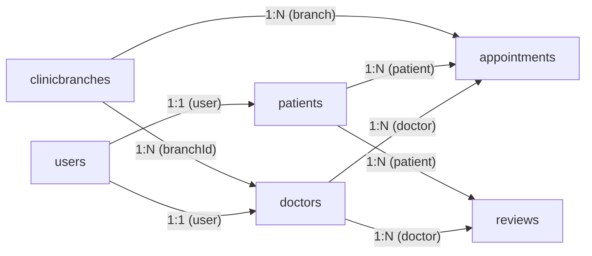

# Database Schema Documentation

## Mr. Dentist — Clinic Management System

| Attribute          | Detail                                      |
| ------------------ | ------------------------------------------- |
| **Document Type**  | Database Schema Documentation               |
| **Database**       | MongoDB (Atlas — Replica Set)               |
| **ODM**            | Mongoose 9.6.x                              |
| **Last Updated**   | 2026-05-19                                  |

---

## 1. Database Overview

The Mr. Dentist system uses **MongoDB**, a NoSQL document database, with **Mongoose** as the Object Document Mapper. The database resides on a **MongoDB Atlas** 3-node replica set, enabling multi-document ACID transactions for operations that span multiple collections.

### 1.1 Collections Summary

| Collection         | Model Name      | Document Count Pattern | Description                              |
| ------------------ | --------------- | ---------------------- | ---------------------------------------- |
| `users`            | User            | High                   | Shared identity for all system actors    |
| `doctors`          | Doctor          | Medium                 | Doctor profiles linked to users          |
| `patients`         | Patient         | High                   | Patient profiles linked to users         |
| `clinicbranches`   | ClinicBranch    | Low                    | Physical clinic locations                |
| `appointments`     | Appointment     | High                   | Scheduled appointment records            |
| `reviews`          | Review          | Medium                 | Patient feedback on doctors              |

---

## 2. Collection Schemas

### 2.1 Users Collection (`users`)

The `users` collection serves as the **centralised identity store** for all system actors. The `role` field acts as a discriminator that determines which extension collection (doctors or patients) is associated with a given user.

| Field         | Type       | Required | Unique | Default                                                                 | Constraints / Notes                          |
| ------------- | ---------- | -------- | ------ | ----------------------------------------------------------------------- | -------------------------------------------- |
| `_id`         | ObjectId   | Auto     | Yes    | Auto-generated                                                          | Primary key                                  |
| `name`        | String     | Yes      | No     | —                                                                       | Trimmed                                      |
| `email`       | String     | Yes      | Yes    | —                                                                       | Trimmed; stored lowercase; unique index      |
| `password`    | String     | Yes      | No     | —                                                                       | bcrypt-hashed (10 salt rounds)               |
| `gender`      | String     | Yes      | No     | —                                                                       | Enum: `["male", "female"]`                   |
| `role`        | String     | Yes      | No     | `"patient"`                                                             | Enum: `["patient", "doctor", "admin"]`       |
| `dateofBirth` | Date       | Yes      | No     | —                                                                       | Patient's date of birth                      |
| `pictureUrl`  | String     | No       | No     | `""` (empty string)                                                     | Cloudinary URL after upload                  |

**Indexes:**

| Index Name    | Fields        | Type    | Notes                           |
| ------------- | ------------- | ------- | ------------------------------- |
| `_id_`        | `_id`         | Primary | Default MongoDB primary key     |
| `email_1`     | `email`       | Unique  | Prevents duplicate registrations|

---

### 2.2 Doctors Collection (`doctors`)

Each document extends a User with dental-practice-specific attributes. A Doctor is always assigned to exactly one ClinicBranch and one shift.

| Field             | Type       | Required | Default | Constraints / Notes                                          |
| ----------------- | ---------- | -------- | ------- | ------------------------------------------------------------ |
| `_id`             | ObjectId   | Auto     | Auto    | Primary key                                                  |
| `user`            | ObjectId   | Yes      | —       | **Ref → `User`**; the associated identity record             |
| `branchId`        | ObjectId   | Yes      | —       | **Ref → `ClinicBranch`**; the assigned clinic branch         |
| `specialty`       | String     | Yes      | —       | Trimmed; e.g., "Orthodontics", "Periodontics"               |
| `shiftID`         | Number     | Yes      | —       | Enum: `[0, 1, 2]` — Morning, Afternoon, Night               |
| `consultationFee` | Number     | Yes      | —       | Minimum: `0`                                                 |
| `description`     | String     | No       | —       | Trimmed; free-text bio/description                           |

**Relationships (populated on read):**

```javascript
Doctor.findById(id).populate("user").populate("branchId")
```

| Populated Field | Target Collection | Selected Fields                         |
| --------------- | ----------------- | --------------------------------------- |
| `user`          | `users`           | All fields (full user profile)          |
| `branchId`      | `clinicbranches`  | All fields (address, phoneNumber)       |

**Transactional Lifecycle:**

- **Create:** `DoctorRepository.createDoctorWithUser()` — creates User and Doctor atomically within a MongoDB session.
- **Update:** `DoctorRepository.updateDoctor()` — updates both User and Doctor records within a transaction.
- **Delete:** `DoctorRepository.deleteDoctor()` — deletes both User and Doctor records within a transaction.

---

### 2.3 Patients Collection (`patients`)

Each document extends a User with patient-specific contact information.

| Field         | Type       | Required | Default | Constraints / Notes                              |
| ------------- | ---------- | -------- | ------- | ------------------------------------------------ |
| `_id`         | ObjectId   | Auto     | Auto    | Primary key                                      |
| `user`        | ObjectId   | Yes      | —       | **Ref → `User`**; the associated identity record |
| `phoneNumber` | String     | Yes      | —       | Patient contact number                           |

**Relationships (populated on read):**

```javascript
Patient.findById(id).populate("user")
```

**Transactional Lifecycle:**

- **Create:** `PatientRepository.createPatientWithUser()` — creates User and Patient atomically.
- **Update:** `PatientRepository.updatePatient()` — updates both User and Patient within a transaction.
- **Delete:** `PatientRepository.deletePatient()` — deletes both User and Patient within a transaction.

---

### 2.4 Clinic Branches Collection (`clinicbranches`)

Represents physical clinic locations. This is a **standalone collection** with no foreign key references to other collections (it is referenced *by* Doctors and Appointments).

| Field         | Type       | Required | Default | Constraints / Notes            |
| ------------- | ---------- | -------- | ------- | ------------------------------ |
| `_id`         | ObjectId   | Auto     | Auto    | Primary key                    |
| `address`     | String     | Yes      | —       | Trimmed; physical address      |
| `phoneNumber` | String     | Yes      | —       | Branch contact number          |

**Referenced By:**

| Referencing Collection | Field       | Relationship  |
| ---------------------- | ----------- | ------------- |
| `doctors`              | `branchId`  | Many-to-One   |
| `appointments`         | `branch`    | Many-to-One   |

---

### 2.5 Appointments Collection (`appointments`)

Records scheduled time slots between patients and doctors. This collection employs a **compound unique index** to guarantee that no two appointments can occupy the same slot.

| Field              | Type       | Required | Default       | Constraints / Notes                                        |
| ------------------ | ---------- | -------- | ------------- | ---------------------------------------------------------- |
| `_id`              | ObjectId   | Auto     | Auto          | Primary key                                                |
| `doctor`           | ObjectId   | Yes      | —             | **Ref → `Doctor`**                                         |
| `patient`          | ObjectId   | Yes      | —             | **Ref → `Patient`**                                        |
| `branch`           | ObjectId   | Yes      | —             | **Ref → `ClinicBranch`**                                   |
| `totalCost`        | Number     | Yes      | `100`         | Minimum: `0`; auto-set from doctor's consultation fee      |
| `appointmentDate`  | Date       | Yes      | —             | The calendar date of the appointment                       |
| `shiftId`          | Number     | Yes      | —             | Enum: `[0, 1, 2]` — maps to shift definitions             |
| `slotTime`         | String     | Yes      | —             | Regex: `^([01]\d\|2[0-3]):[0-5]\d$` (24-hour `HH:MM`)    |
| `createdAt`        | Date       | No       | `Date.now`    | Timestamp of booking creation                              |

**Indexes:**

| Index Name                                        | Fields                                              | Type            | Purpose                              |
| ------------------------------------------------- | --------------------------------------------------- | --------------- | ------------------------------------ |
| `_id_`                                            | `_id`                                               | Primary         | Default primary key                  |
| `doctor_1_appointmentDate_1_shiftId_1_slotTime_1` | `doctor`, `appointmentDate`, `shiftId`, `slotTime` | Compound Unique | **Prevents double-booking**          |

**Index Definition:**

```javascript
appointmentSchema.index(
  { doctor: 1, appointmentDate: 1, shiftId: 1, slotTime: 1 },
  { unique: true }
);
```

**Relationships (populated on read):**

For patient-facing queries:
```javascript
Appointment.find({ patient: patientId })
  .populate({
    path: "doctor",
    select: "user specialty",
    populate: { path: "user", select: "name" }
  })
  .populate("branch")
```

For doctor-facing queries:
```javascript
Appointment.find({ doctor: doctorId })
  .populate({
    path: "patient",
    select: "user",
    populate: { path: "user", select: "name" }
  })
  .populate("branch")
```

---

### 2.6 Reviews Collection (`reviews`)

Stores patient feedback on doctors. Uniqueness (one review per patient per doctor) is enforced at the **application level** in the `ReviewController`.

| Field     | Type       | Required | Default | Constraints / Notes                  |
| --------- | ---------- | -------- | ------- | ------------------------------------ |
| `_id`     | ObjectId   | Auto     | Auto    | Primary key                          |
| `doctor`  | ObjectId   | Yes      | —       | **Ref → `Doctor`**                   |
| `patient` | ObjectId   | Yes      | —       | **Ref → `Patient`**                  |
| `rating`  | Number     | Yes      | —       | Minimum: `1`, Maximum: `5`           |
| `comment` | String     | No       | —       | Trimmed; optional text feedback      |

**Application-Level Constraint:**

```javascript
// ReviewController.createReview
if (await ReviewRepository.hadReviewed(patientId, doctorId)) {
  return res.status(400).json({ message: "You have already reviewed this doctor" });
}
```

**Relationships (populated on read):**

```javascript
// Doctor's reviews — show patient names
Review.find({ doctor: doctorId }).populate({
  path: "patient",
  select: "user",
  populate: { path: "user", select: "name" }
});

// Patient's reviews — show doctor names
Review.find({ patient: patientId }).populate({
  path: "doctor",
  select: "user",
  populate: { path: "user", select: "name" }
});
```

---

## 3. Relationship Map



### 3.1 Relationship Summary Table

| Relationship                    | Type      | From Collection    | To Collection      | Foreign Key Field   | Cascade Behavior       |
| ------------------------------- | --------- | ------------------ | ------------------- | ------------------- | ---------------------- |
| User → Doctor                   | 1:1       | `doctors`          | `users`             | `doctor.user`       | Transactional delete   |
| User → Patient                  | 1:1       | `patients`         | `users`             | `patient.user`      | Transactional delete   |
| ClinicBranch → Doctor           | 1:N       | `doctors`          | `clinicbranches`    | `doctor.branchId`   | Manual (no cascade)    |
| Doctor → Appointment            | 1:N       | `appointments`     | `doctors`           | `appointment.doctor`| Manual                 |
| Patient → Appointment           | 1:N       | `appointments`     | `patients`          | `appointment.patient`| Manual                |
| ClinicBranch → Appointment      | 1:N       | `appointments`     | `clinicbranches`    | `appointment.branch`| Manual                 |
| Doctor → Review                 | 1:N       | `reviews`          | `doctors`           | `review.doctor`     | Manual                 |
| Patient → Review                | 1:N       | `reviews`          | `patients`          | `review.patient`    | Manual                 |

---

## 4. Data Validation Summary

| Collection       | Field             | Validation Type              | Rule                                          |
| ---------------- | ----------------- | ---------------------------- | --------------------------------------------- |
| `users`          | `email`           | Unique index                 | No duplicate email addresses                   |
| `users`          | `gender`          | Mongoose enum                | Must be `"male"` or `"female"`                 |
| `users`          | `role`            | Mongoose enum                | Must be `"patient"`, `"doctor"`, or `"admin"` |
| `doctors`        | `shiftID`         | Mongoose enum                | Must be `0`, `1`, or `2`                       |
| `doctors`        | `consultationFee` | Mongoose min                 | Must be ≥ `0`                                  |
| `appointments`   | `shiftId`         | Mongoose enum                | Must be `0`, `1`, or `2`                       |
| `appointments`   | `slotTime`        | Regex match                  | `^([01]\d\|2[0-3]):[0-5]\d$`                  |
| `appointments`   | `totalCost`       | Mongoose min                 | Must be ≥ `0`                                  |
| `appointments`   | Compound key      | Unique compound index        | `{doctor, appointmentDate, shiftId, slotTime}` |
| `reviews`        | `rating`          | Mongoose min/max             | Must be between `1` and `5` (inclusive)        |
| `reviews`        | Duplicate check   | Application-level            | One review per patient per doctor              |

---

*Document prepared for Mr. Dentist Clinic Management System — Confidential.*
